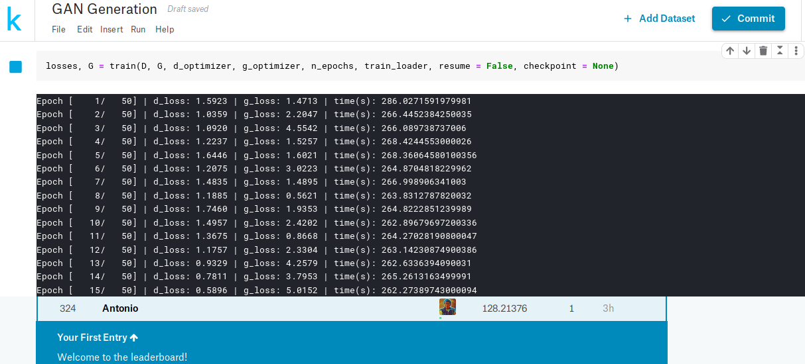

# 60daysofudacity
This repository contains the daily updates made during the 60daysofudacity challenge. This was an initiative from the Secure and Private AI Challenge Scholarship program.

# DAY 1 [1.6%] | 60
Begin with the #60daysofudacity challenge, completed the following:

* Lesson3: Introducing Differential Privacy [completed]
* Read the Book The Algorithmic Foundations of Differential Privacy, section 1: The Promise of Differential Privacy [page: 5 – 10].
* Working in the implementation of the project for the Lesson 3.

__What I learn:__
This was my first introduction to the field of Differential Privacy. As pointed out in the lectures, it is important to have a well defined framework, which allow us to define what is really to be private in the context of deep learning. Also, from the book, I can now see how the notion of privacy have been evolving. As with many field related in computer science, it is obvious to predict, that, in the future, the field will become more complex.

# DAY 2 [3.3%] | 60
 
* Implementation of the project 2 for the Lesson 3 completed.
* Added a plot for the project, where the data distribution can be compared using two databases.
* Taking a recap from Lesson 3.

__What I learn:__
This was a very interesting project, where we created a main database, containing a single feature with ones and zeros. Also, we implemented a function to create more databases from the main one, with one row missing per database (a total of 5000 dbs). I noticed how we select the probability distribution for the samples to be 50%. This give me the idea to plot the density distribution for the databases using different probabilities. In fact, I plot a standard DB with p = 0.5 against one with p = 0.7. This help me to understand how the probability parameter affected the creation of the databases.

# DAY 3 [5.0%] | 60
* Beginning with Lesson 4: Evaluating the Privacy of a Function [videos 1 and 2]
* Working in the initial project for this lesson.

__What I learn:__
It is interesting to see how some simple arithmetic functions, like sums, can be used to guest the identity of an individual in a database. This of course, makes necessary to address such issues. In the following day I will continue watching the lectures.

# DAY 4 [6.7%] | 60
* Project: Intro Evaluating The Privacy Of A Function completed
* Continuing with Lesson 4: Evaluating the Privacy of a Function [videos 3, 4, 5 and 6]

__What I learn:__
In this lesson I learn that it is possible to guest some of the distribution of the data applying simple arithmetic functions. Moreover, one can guest the individuals identity in a database. This means, we must implement the necessary mechanisms to guarantee the privacy in databases. _See notebook for day 4_

# DAY 5 [8.3%] | 60
* Evaluating The Privacy Of A Function using the iris data set.
* Working on projects [3, 4, 5 and 6] from Lesson 4: Evaluating the Privacy of a Function.

__What I learn:__
In this day, I implemented a function to calculate the sensitivity of the iris data set. Since we were working with a single feature, I evaluated the sensitivity of each feature using the sum query. I noticed how the sensitivity is affected for each feature when applying a simple sum operation. This is very interesting and shows how data can be susceptible when applying such operations. _See notebook for day 5_

# DAY 6 [10.0%] | 60

* Finish  Lesson 4: Evaluating the Privacy of a Function
* Completed projects all projects from this Lesson.
* Recap the Lesson.

__What I learn:__
In this lesson I learn about the implementation of a differencing attack over a database using the threshold query. Moreover, different functions can be applied in order to get information from databases. Also, data tend to be susceptible for such operations. _See notebook for day 6_

# DAY 7 [11.7%]
* Beginning with Lesson 5: Introducing Local and Global Differential Privacy [videos 1 – 4].
* Reading section 2:  [page: 11 – 15] from the Book The Algorithmic Foundations of Differential Privacy.

__What I learn:__
I learn about two types of privacy, which are local and global privacy. In the first method, the data is altered with some type of noise. This method guarantees more protection for the users, since the data itself is been altered. On the other hand, in global privacy, the noise is added to the output of the query, instead of the data itself as with local privacy. From this context I think, that in some scenarios, global privacy could be more effective, since local privacy has an inherent resource cost.

# DAY 8 [13.3%] | 60
* Continuing with Lesson 5 [videos 5 – 7].
* Working on the Project: Implement Local Differential Privacy

__What I learn:__
Today I learn about two types of noise, which can be added in global privacy: Gaussian and Laplacian. From this type of noises, at the time, the Laplacian noise is more widely used, due to its relative easy calculation. Also, the formal definition of privacy implement two important factors: epsilon and delta. The former measures the difference in distributions from the original data and the data with missing entries. Meanwhile, delta represent the probability of leaking extra information. For that reason, the usual values to delta are very tiny or zero.

# DAY 9 [15.0%] | 60
* Project: Implement Local Differential Privacy [completed]
* Applying variations to the project [1] [adding different values of epsilon, plots, run more tests]

__What I learn:__
Today I learn about how the amount of data can impact the queries over a data base. More precisely, I set up an experiment, where the mean query was executed with different entries in a database. I notice that, each time the entries increase, the approximation for the real value of the mean query was more close. Meaning the differential data come more close to the real result of the query on the real data. When repeating this experiment multiples times I observed the same results. At first, with less entries, the distance in the results where big. However, the more entries, the more close the results were to the real ones. This result reaffirms the discussion on the lectures. _See notebook for day 9_

# DAY 10 [16.7%] | 60
* Adding final variations to the Project from Lesson 5 [plot more functions]
* Beginning to work on the final project for Lesson 5.

__What I learn:__
Today I decided to continue with the experiments from the last project. This time, I added four extra queries: cumulative sum, random sum, logarithm sum and standard deviation. After running the experiments, I noticed that using the cumulative query, one can approximate the real query on the data base with little entries. However, increasing the entries, will also increase the gap between the queries. This is also true for the random sum and logarithm sum queries. On the contrary, the standard deviation query, acts in the same fashion as the mean query. Where with more data, the results will better approximate. This help me to understand that, not all queries behave in the same ways. Therefore, when applying global privacy, one must careful consider the used mechanisms. _See notebook for day 10_

# DAY 11 [18.3%] | 60
* Finished final project for Lesson 5: Create a Differentially Private Query.
* Recap from Lesson 5.

__What I learn:__
Global and local privacy are two types of privacy mechanism which can be implemented. I think that, in the case of deep learning, one could be more inclined to use global privacy, since it only affects the outputs of the model. In contrast, with local privacy, one must change the data. This process could be expensive in some settings. For example, with many images. However I think that local privacy can be applied in the context of machine learning, when cost of transforming the data is low. _See notebook for day 11_

# DAY 12 [20.0%] | 60
* Entering a Kaggle competition: Generative Dog Images. | Goal: make a submission and apply the learned on the DLND program. 
* Creating the data set from the training data using torch vision.
* Working in some potentially architectures.

__What I learn:__

Today I decided to take part in a Kagle competition. This competition is about creating a GAN model to generated dog images. To start, this data set is composed by a total of 20579 images. However, not all the images displays the targets (dogs). There are some samples where other labels are presents, like: persons, etc. Also, it is very interesting to see how GAN’s can be applied to different problems.

# DAY 13 [21.7%] | 60
* Having an interesting discussion about research topics in machine learning.
* Training a baseline GAN model to generate dog images.
* Sending my initial submission for the Kaggle competition: Generative Dog Images.
* Planning on future improvements for the baseline model.

__What I learn:__

Today, I learned how convolutional neural networks can be applied to recognize sign language characters. It is interesting to see how convolutional networks models can achieve great accuracy in such tasks. Regarding the training of my GAN model, I noticed how the features (filters) can play an important role at the moment to generate quality images. In fact, applying variations can lead to more natural results. However, other aspects like the number of convolutional layers can also affect the learned representations. Therefore I think a gradual approach should be considered, where in each stage, a set of layers / features are added, until get a desired result according with the available  computational resources.

# DAY 14 [23.3%] | 60* #60daysofudacity

* Beginning with Lesson 6: Differential Privacy for Deep Learning.
* Studying lectures: 1, 2 and 3.
* Reading the paper: Generating Diverse High-Fidelity Images with VQ-VAE-2: https://arxiv.org/pdf/1906.00446.pdf

__What I learn:__

Today, I learned about how to generate labels in a differentially private setting. More precisely, this technique allow us to generate labels using external classifiers. Of course, this classifiers must belong to the same category we want to obtain the labels. In this case, we have our data which we do not have the labels, and we will use these classifiers to generate our labels. However, in order to assure the privacy component, we will add some degree of epsilon (privacy leak) over the generation of the labels. This will be used as part of a Laplacian noise mechanism (we can use Gaussian too). In this way, we are obtaining the labels for our local data set without compromising the privacy of the individuals in the external data sets. Also, from the paper I read today, I learned about the VQ-VAE-2 model. This generative model is able to generate realistic images using a vector quantized mechanism.

# DAY 15 [25.0%] | 60
* Continuing with Lesson 6.
* Studying lectures: 4, 5.
* Reading the suggested paper material: Deep Learning with Differential Privacy [completed].

__What I learn:__

Today, I learned about PATE analysis, a technique which allow us to analyze how much information is leaked out. In this context, PATE analysis will measure the degree of the epsilon parameter. However, it is also possible to apply differential privacy to the models instead. In particular, a variation of the SGD algorithm can be used. This DPSGD calculate the gradients from a random subset of the data. Then it clips the gradients using the L2 norm. Next, it averages the gradients and add noise. Here, the noise is one of the mechanism to assure privacy. Finally it moves the gradients in the opposite direction of the average gradients (which have some degree of noise). As we can see, this algorithm can be used to train a model at the same time that maintains the user privacy.
